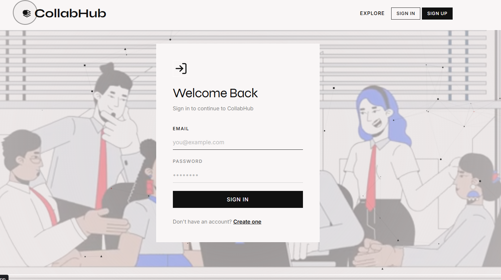

# CollabHub

CollabHub is a full-stack web application designed to help developers collaborate on projects. Users can create projects, request to join teams, manage members, and showcase their skills and profiles.

The platform is built with a modern **MERN-style architecture** where the **frontend handles the user interface** and the **backend manages data, authentication, and project logic**.

---

# Screenshots

### Home Page
<div align="center">
  
  
</div>

---

# Features

### User Features

* User registration and login
* Secure authentication using JWT
* User profile with skills, bio, and GitHub link
* View other developers' profiles

### Project Features

* Create and manage projects
* Search projects by title, technology stack, or roles
* Send join requests to projects
* Approve or reject join requests
* Remove project members
* Dashboard showing your owned or joined projects

### Security Features

* JWT authentication
* Protected routes
* Owner-based project permissions
* Secure HTTP-only cookies

---

# Tech Stack

## Frontend

* React
* Vite
* React Router
* Axios
* Context API
* Custom CSS (Neo-Brutalist design)

## Backend

* Node.js
* Express.js
* MongoDB
* Mongoose
* JWT Authentication
* Bcrypt Password Hashing

---

# Project Structure

## Backend

```
backend/
├── server.js
├── package.json
└── src
    ├── app.js
    ├── db
    │   └── db.js
    ├── models
    │   ├── user.model.js
    │   └── project.model.js
    ├── middleware
    │   ├── auth.middleware.js
    │   └── projectowner.middleware.js
    ├── controllers
    │   ├── auth.controller.js
    │   └── project.controller.js
    └── routes
        ├── auth.route.js
        └── project.routes.js
```

### Backend Responsibilities

* Handle authentication
* Manage projects and users
* Process join requests
* Enforce security and permissions
* Communicate with MongoDB

---

## Frontend

```
frontend/
├── package.json
├── index.html
├── vite.config.js
└── src
    ├── main.jsx
    ├── App.jsx
    ├── index.css
    ├── context
    │   └── AuthContext.jsx
    ├── services
    │   └── api.js
    ├── components
    │   ├── Navbar.jsx
    │   ├── Footer.jsx
    │   ├── CustomCursor.jsx
    │   ├── ParticleBackground.jsx
    │   └── ProtectedRoute.jsx
    └── pages
        ├── Home.jsx
        ├── Login.jsx
        ├── Register.jsx
        ├── CreateProject.jsx
        ├── MyProjects.jsx
        ├── Profile.jsx
        ├── UserProfile.jsx
        └── ProjectDetail.jsx
```

### Frontend Responsibilities

* Display user interface
* Manage routing between pages
* Handle forms and user input
* Communicate with backend APIs
* Manage authentication state using Context

---

# Application Workflow

1. User opens the website.
2. React frontend loads and displays the homepage.
3. Frontend sends API requests to the backend using Axios.
4. Backend processes the request and interacts with MongoDB.
5. Backend returns data to the frontend.
6. Frontend updates the UI accordingly.

Example flow for creating a project:

1. User fills the **Create Project** form.
2. Frontend sends request to `/api/project/create`.
3. Backend verifies authentication using middleware.
4. Controller processes the request.
5. Project is saved in MongoDB.
6. Response is returned and UI updates.

---

# Installation & Setup

## 1 Clone the Repository

```bash
git clone https://github.com/yourusername/collabhub.git
cd collabhub
```

---

## 2 Setup Backend

```bash
cd backend
npm install
```

Create a `.env` file:

```
PORT=3000
MONGO_URI=your_mongodb_connection_string
JWT_SECRET=your_secret_key
```

Run backend server:

```
npm start
```

---

## 3 Setup Frontend

```bash
cd frontend
npm install
npm run dev
```

Frontend will start on:

```
http://localhost:5173
```

Backend will run on:

```
http://localhost:3000
```

---

# API Endpoints

## Authentication

```
POST /api/auth/register
POST /api/auth/login
POST /api/auth/logout
PUT  /api/auth/profile
```

## Projects

```
GET    /api/project
POST   /api/project/create
PUT    /api/project/update/:id
DELETE /api/project/delete/:id
POST   /api/project/request
POST   /api/project/:id/respond
POST   /api/project/remove-member/:projectId
GET    /api/project/search
```

---

# Future Improvements

* Real-time collaboration using WebSockets
* Notifications system
* Project commenting system
* Team chat feature
* Project recommendations

---

# Author

Developed as a full-stack collaboration platform project.