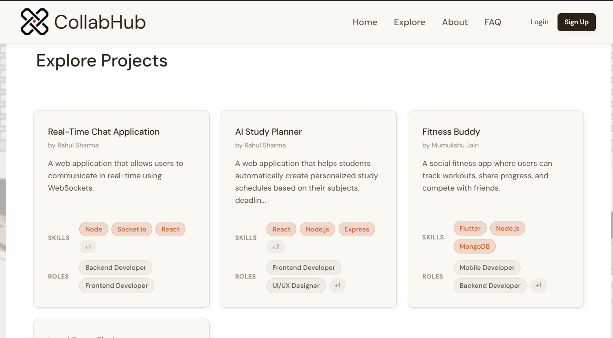
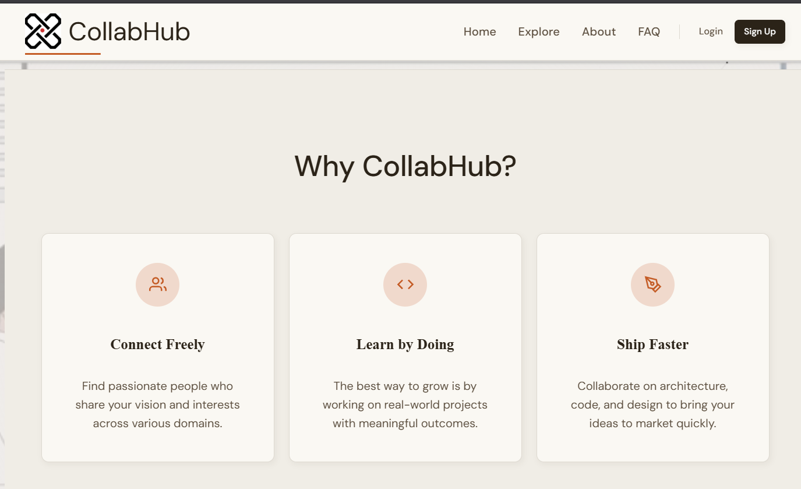
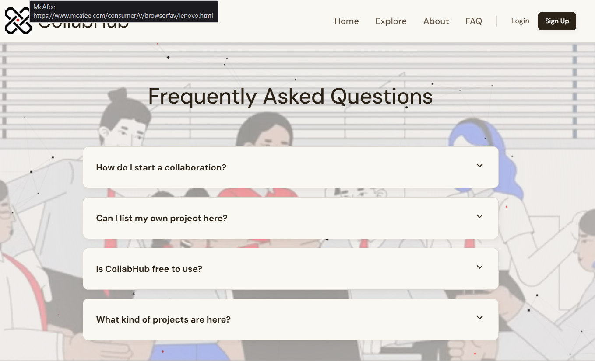

# 🚀 CollabHub


**CollabHub** is a full-stack web platform designed to help developers **discover projects, collaborate with teams, and showcase their skills**.

The platform allows developers to:

- Build and manage projects
- Find collaborators
- Request to join development teams
- Showcase developer profiles
- Manage project members

It follows a **modern MERN-style architecture** where the frontend handles user interaction while the backend manages authentication, data, and project logic.

---

# 📌 Table of Contents

- Overview
- Screenshots
- Core Features
- Tech Stack
- Architecture
- Project Structure
- API Endpoints
- Installation
- Environment Variables
- Application Workflow
- Future Improvements
- Contributing
- Author

---

# 📖 Overview

Many developers struggle to **find teammates for side projects**.

CollabHub solves this by creating a **central collaboration hub** where developers can:

- Publish project ideas
- Recruit teammates
- Join interesting projects
- Showcase their technical skills

The platform simulates how **real developer collaboration platforms** work.

---

# 📸 Screenshots

<div align="center">





</div>

---

# ✨ Core Features

## 👤 User System

- User registration and login
- Secure authentication using JWT
- Personal developer profile
- Add bio, skills, and GitHub profile
- View other developer profiles

---

## 📂 Project Management

- Create new projects
- Edit and delete projects
- Search projects by:
  - Title
  - Technology stack
  - Developer roles
- Send join requests
- Approve or reject requests
- Remove project members
- Dashboard displaying joined and owned projects

---

## 🔐 Security

- JWT authentication
- Bcrypt password hashing
- HTTP-only cookies
- Protected routes
- Owner-based project permissions

---

# 🛠 Tech Stack

## Frontend

- React
- Vite
- React Router
- Axios
- Context API
- Custom CSS (Neo-Brutalist UI design)

---

## Backend

- Node.js
- Express.js
- MongoDB
- Mongoose
- JWT Authentication
- Bcrypt Password Hashing

---

# 🧠 Architecture

CollabHub follows a **client-server architecture**.

```
React Frontend
      │
      │  HTTP Requests (Axios)
      ▼
Express API Server
      │
      │ Database Queries
      ▼
MongoDB Database
```

### Frontend Responsibilities

- UI rendering
- Routing
- State management
- Form handling
- API communication

### Backend Responsibilities

- Authentication
- Authorization
- Business logic
- Database operations
- Project and user management

---

# 📂 Project Structure

## Backend

```
backend
│
├── server.js
├── package.json
│
└── src
    ├── app.js
    │
    ├── db
    │   └── db.js
    │
    ├── models
    │   ├── user.model.js
    │   └── project.model.js
    │
    ├── middleware
    │   ├── auth.middleware.js
    │   └── projectowner.middleware.js
    │
    ├── controllers
    │   ├── auth.controller.js
    │   └── project.controller.js
    │
    └── routes
        ├── auth.route.js
        └── project.routes.js
```

### Backend Responsibilities

- Manage users and projects
- Handle authentication
- Process join requests
- Enforce permissions
- Communicate with MongoDB

---

## Frontend

```
frontend
│
├── package.json
├── index.html
├── vite.config.js
│
└── src
    ├── main.jsx
    ├── App.jsx
    ├── index.css
    │
    ├── context
    │   └── AuthContext.jsx
    │
    ├── services
    │   └── api.js
    │
    ├── components
    │   ├── Navbar.jsx
    │   ├── Footer.jsx
    │   ├── CustomCursor.jsx
    │   ├── ParticleBackground.jsx
    │   └── ProtectedRoute.jsx
    │
    └── pages
        ├── Home.jsx
        ├── Login.jsx
        ├── Register.jsx
        ├── CreateProject.jsx
        ├── MyProjects.jsx
        ├── Profile.jsx
        ├── UserProfile.jsx
        └── ProjectDetail.jsx
```

### Frontend Responsibilities

- Display application UI
- Manage routing
- Handle user input
- Communicate with backend APIs
- Maintain authentication state

---

# 🔌 API Endpoints

## Authentication

```
POST /api/auth/register
POST /api/auth/login
POST /api/auth/logout
PUT  /api/auth/profile
```

---

## Projects

```
GET    /api/project
POST   /api/project/create
PUT    /api/project/update/:id
DELETE /api/project/delete/:id
POST   /api/project/request
POST   /api/project/:id/respond
POST   /api/project/remove-member/:projectId
GET    /api/project/search
```

---

# ⚙️ Installation

## Clone Repository

```
git clone https://github.com/yourusername/collabhub.git
cd collabhub
```

---

## Backend Setup

```
cd backend
npm install
npm start
```

Backend runs on:

```
http://localhost:3000
```

---

## Frontend Setup

```
cd frontend
npm install
npm run dev
```

Frontend runs on:

```
http://localhost:5173
```

---

# 🔑 Environment Variables

Create a `.env` file inside the backend directory.

```
PORT=3000
MONGO_URI=your_mongodb_connection_string
JWT_SECRET=your_secret_key
```

---

# 🔄 Application Workflow

### Example: Creating a Project

1. User fills **Create Project Form**
2. Frontend sends request

```
POST /api/project/create
```

3. Backend verifies authentication
4. Controller processes request
5. Project is saved in MongoDB
6. Backend returns response
7. UI updates automatically

---

# 🚧 Future Improvements

- Real-time collaboration with WebSockets
- Project comments system
- Team chat
- Notifications
- GitHub integration
- AI project recommendations

---

# 🤝 Contributing

Contributions are welcome.

1. Fork the repository
2. Create a feature branch

```
git checkout -b feature-name
```

3. Commit changes

```
git commit -m "Add new feature"
```

4. Push branch

```
git push origin feature-name
```

5. Open a Pull Request

---

# 👨‍💻 Author

Developed by **Your Name**

Full-Stack Developer

GitHub  
https://github.com/yourusername

---

⭐ If you like this project, consider giving it a **star**!